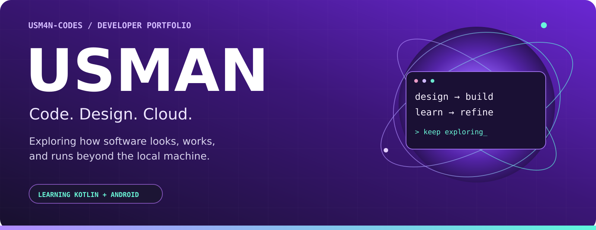
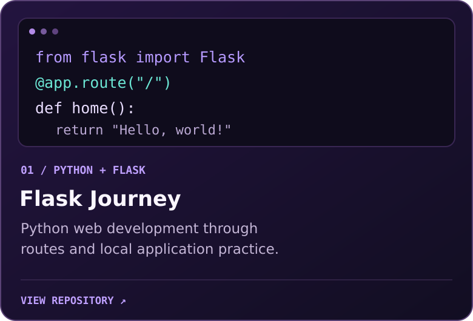
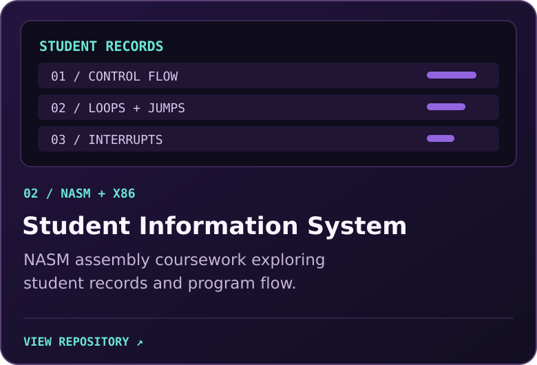
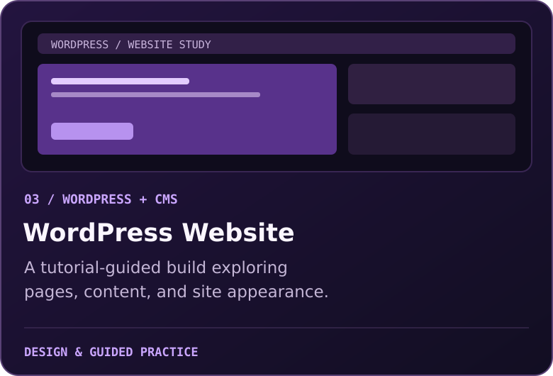
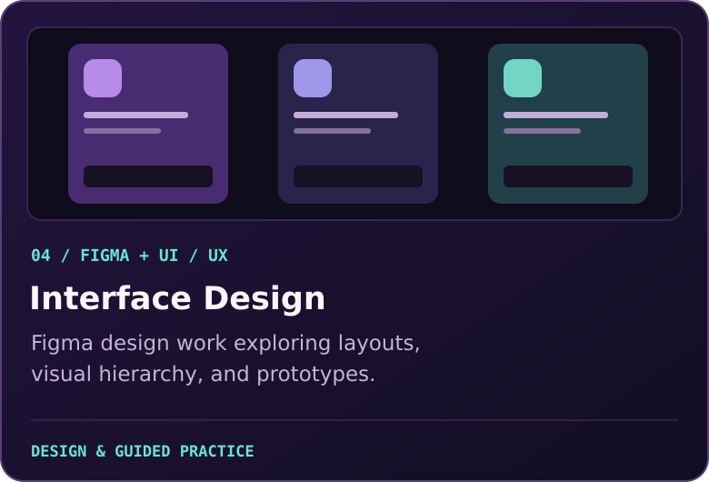
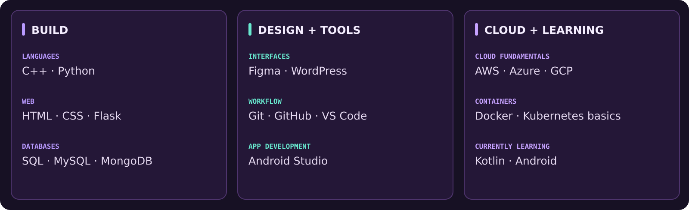
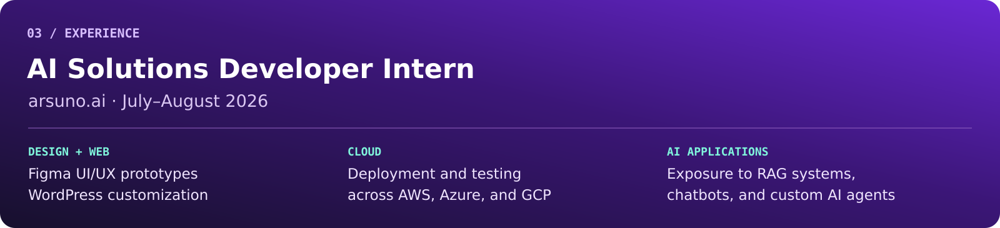
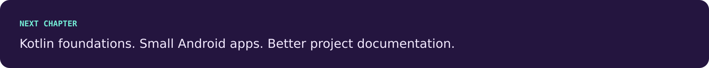

  

  <b>Student developer exploring software, interfaces, and cloud applications.</b> 
  My work spans C++, Python, Flask, WordPress, and Figma, with practical cloud and AI exposure through an internship.

  <a href="https://github.com/usm4n-codes?tab=repositories"><b>Explore repositories ↗</b></a>

 

<table>
  <tr>
    <td width="50%"></td>
    <td width="50%"></td>
  </tr>
  <tr>
    <td width="50%"></td>
    <td width="50%"></td>
  </tr>
</table>

Project card graphics are illustrative; they are not screenshots of the projects.

  

  

  

 

<a href="https://github.com/usm4n-codes">usm4n-codes</a> &nbsp; / &nbsp; Learning through practice.

