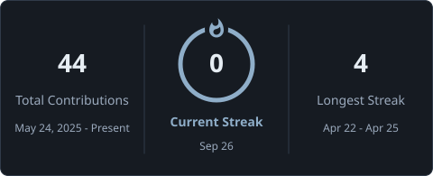

<h1>
  
</h1>

### Computer Science Student at IST

Building my foundations in software development, interface design, and cloud applications.

I work with **C++, Python, and Flask**, create websites and interfaces with
**WordPress and Figma**, and am currently learning **Kotlin and Android development**.

[Explore my repositories ↗](https://github.com/usm4n-codes?tab=repositories)

## Selected work

| Project | Stack | What I worked on | Source |
| :--- | :--- | :--- | :--- |
| **Flask Journey** | `Python` `Flask` | Practised URL routing and running a Flask application locally. | [Repository ↗](https://github.com/usm4n-codes/Flask-Journey) |
| **Student Information System** | `NASM` `x86 Assembly` | Explored student-record operations, loops, jumps, and interrupts through coursework. | [Repository ↗](https://github.com/usm4n-codes/COAL-Project-SMS) |

**Additional practical work**

- **WordPress website:** built a tutorial-guided website and practised managing pages, content, and appearance.
- **Figma designs:** created interface designs and prototypes, exploring layout and visual hierarchy.

## Toolkit

Technologies I have used or studied. Cloud platforms and databases reflect
foundational knowledge; Kubernetes is basic familiarity.

**Programming · C++ and Python**

  
  &nbsp;
  

**Web and design · HTML, CSS, Flask, WordPress, Figma**

  
  &nbsp;
  
  &nbsp;
  
  &nbsp;
  
  &nbsp;
  

**Databases · SQL, MySQL, MongoDB**

  
  &nbsp;
  

**Cloud and containers · AWS, Azure, Google Cloud, Docker, Kubernetes**

  
  &nbsp;
  
  &nbsp;
  
  &nbsp;
  
  &nbsp;
  

**Development tools · Git, GitHub, VS Code, Android Studio**

  
  &nbsp;
  
  &nbsp;
  
  &nbsp;
  

**Currently learning · Kotlin and Android development**

  

## Experience

### AI Solutions Developer Intern · arsuno.ai

**July–August 2026**

- Worked on **Figma UI/UX prototypes** and **WordPress development and customization**.
- Gained practical exposure to application **deployment and testing on AWS, Azure, and GCP**.
- Explored **retrieval-augmented generation (RAG)**, generative AI systems, Microsoft Bot Framework chatbots, and custom AI agents.

## Next chapter

- Strengthen my **Kotlin foundations** and apply them to small Android applications.
- Practise connecting application code to **databases and cloud services**.
- Improve project documentation with **setup instructions, implementation details, and lessons learned**.

## GitHub activity

  

  

  

Language statistics reflect repository contents, not proficiency.

